# 实验2：图书管理系统用例建模
|     学号     |     班级     | 姓名 |
| :----------: | :----------: | :--: |
| 201710414108 | 软件(本)17-1 | 李兴 |
## 1. 图书管理系统的用例关系图

### 1.1 用例图源码：

``` usecase
@startuml
usecase (预定图书)
usecase (取消预定)
usecase (读者信息管理)
usecase (查询图书)
usecase (借出图书)
usecase (归还图书)
usecase (维护书目)
usecase (查询借阅情况)
usecase (购入图书)
usecase (管理系统)

actor :图书管理员:
actor :读者:
actor :系统管理员:

:图书管理员: --> (检索图书)
:图书管理员: --> (读者信息管理)
:图书管理员: --> (维护书目)
:图书管理员: --> (查询图书)
:图书管理员: --> (查询借阅情况)

:读者: --> (查询图书)
:读者: --> (查询借阅情况)
:读者: --> (预定查询)

:系统管理员: --> (管理系统)

(维护书目) ..> (购入图书) : include
(检索图书) ..> (借出图书) : include
(检索图书) ..> (归还图书) : include
(预定查询) ..> (预定图书) : include
(预定查询) ..> (取消预定) : include

@enduml
```


### 1.2. 用例图如下：

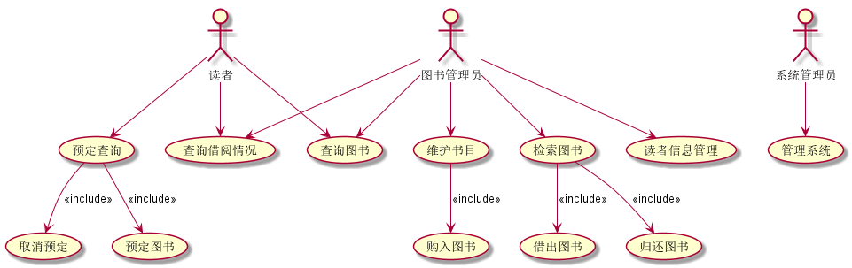	

## 2. 参与者说明：

###     2.1 图书管理员

主要职责是：管理图书馆所有的书籍借出与归还,管理图书，管理读者信息

###     2.2 读者

主要职责是：在图书馆中进行书目的查询，查询借阅情况，预定图书和取消预定图书

###     2.3 系统管理员

主要职责是：管理系统

## 3.用例规约图

### 3.1查询图书用例

用例流程图源码如下:

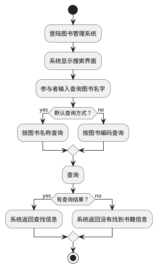

用例流程图如下:

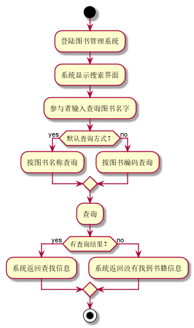	

用例规约如下:

| 用例名称                                                     | 查询图书                                                |
| ------------------------------------------------------------ | ------------------------------------------------------- |
| 参与者                                                       | 图书管理员、读者                                        |
| 前置条件                                                     | 登陆图书管理系统                                        |
| 后置条件                                                     | 查询图书信息                                            |
| 主事件流                                                     |                                                         |
| 参与者动作                                                   | 系统行为                                                |
| 2.参与者输入查询图书名字；                                   | 1.系统显示搜索界面；     3.系统返回查找信息，用例结束； |
| 备选事件流                                                   |                                                         |
| 2a.用户使用图书编码查询       1.系统使用编码查询    3a.系统没有查到任何内容       1.系统提示没有找到书籍信息，用例结束 |                                                         |
| 业务规约                                                     |                                                         |
| 1.对于参与者输入图书名称查询时，系统返回带该名称的图书信息； |                                                         |

​	

### 3.2预定图书用例

用例流程图源码如下:


用例流程图如下:

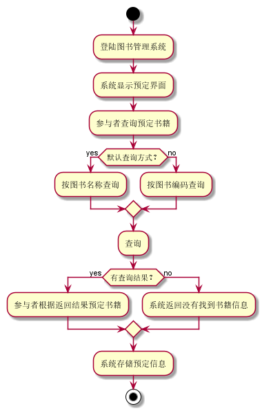	

用例规约如下:

| 用例名称                                                     | 预定图书                                                     |
| ------------------------------------------------------------ | ------------------------------------------------------------ |
| 参与者                                                       | 读者                                                         |
| 前置条件                                                     | 进入图书管理系统首页                                         |
| 后置条件                                                     | 登陆成功                                                     |
| 主事件流                                                     |                                                              |
| 参与者动作                                                   | 系统行为                                                     |
| 2.参与者查询预定书籍  4.参与者根据返回结果预定书籍           | 1.系统显示预定界面；     3.系统根据书籍名称进行查询，并返回查询结果;  5.系统存储预定信息，用例结束 |
| 备选事件流                                                   |                                                              |
| 2a.用户使用图书编码查询       1.系统使用编码查询    3a.系统没有查到图书内容       1.系统返回没有找到书籍信息，用例结束 |                                                              |
| 业务规约                                                     |                                                              |
| 只能同时查询一本书籍，预定可以预定多本书籍                   |                                                              |

​	

### 3.3取消预定用例

用例流程图源码如下:

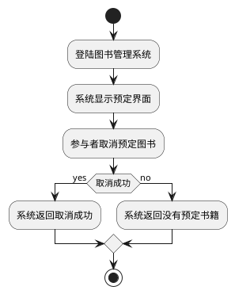

用例流程图如下:

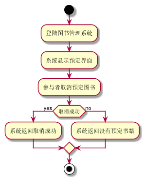	

用例规约如下:

| 用例名称                                                     | 取消预定                                                     |
| ------------------------------------------------------------ | ------------------------------------------------------------ |
| 参与者                                                       | 读者                                                         |
| 前置条件                                                     | 进入图书管理系统首页                                         |
| 后置条件                                                     | 登陆成功                                                     |
| 主事件流                                                     |                                                              |
| 参与者动作                                                   | 系统行为                                                     |
| 2.参与者取消预定书籍                                         | 1.系统显示取消预定界面；     3.系统根据参与者选择的取消书籍名称，取消预定，返回取消成功结果，用例结束 |
| 备选事件流                                                   |                                                              |
| 3a没有预定书籍信息     1.系统返回没有预定书籍信息，取消预定失败，用例结束 |                                                              |
| 业务规约                                                     |                                                              |
| 可以取消预定多本书籍，但前提是得有预定书籍                   |                                                              |

​	

### 3.4查询借阅情况用例

用例流程图源码如下:

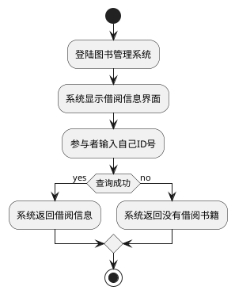

用例流程图如下:

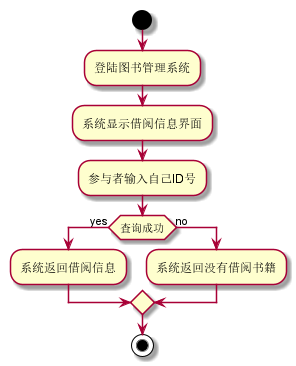	

用例规约如下:

| 用例名称                                                     | 查询借阅情况                                          |
| ------------------------------------------------------------ | ----------------------------------------------------- |
| 参与者                                                       | 读者，图书管理员                                      |
| 前置条件                                                     | 进入图书管理系统首页                                  |
| 后置条件                                                     | 查询图书信息                                          |
| 主事件流                                                     |                                                       |
| 参与者动作                                                   | 系统行为                                              |
| 2.参与者输入用户ID                                           | 1.系统显示借阅界面；     3.系统返回借阅信息，用例结束 |
| 备选事件流                                                   |                                                       |
| 3a系统没有查到借阅书籍信息     1.系统返回没有借阅书籍信息，用例结束 |                                                       |
| 业务规约                                                     |                                                       |
| 用户根据自己ID进行借阅信息的查询                             |                                                       |

​	

### 3.5购入图书用例

用例流程图源码如下:

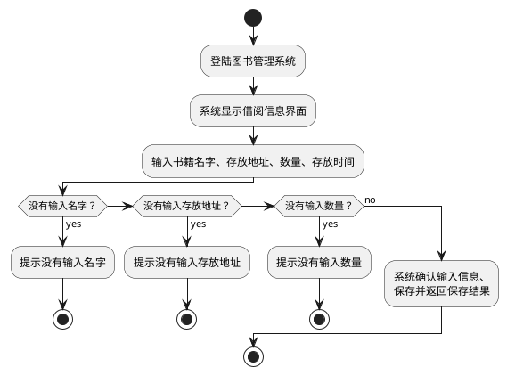

用例流程图如下:

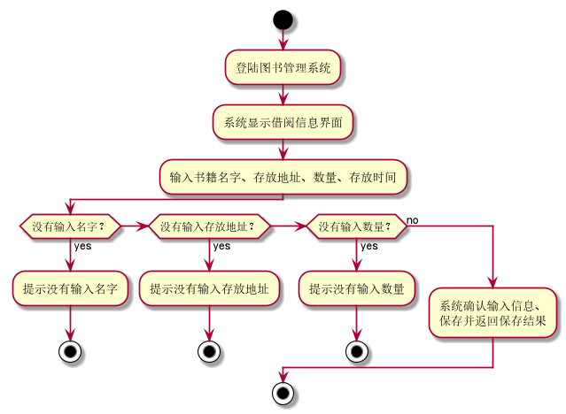	

用例规约如下:

| 用例名称                                                     | 购入图书                                                     |
| ------------------------------------------------------------ | ------------------------------------------------------------ |
| 参与者                                                       | 图书管理员                                                   |
| 前置条件                                                     | 登陆图书管理系统                                             |
| 后置条件                                                     | 添加图书信息                                                 |
| 主事件流                                                     |                                                              |
| 参与者动作                                                   | 系统行为                                                     |
| 2.采编员输入图书信息                                         | 1.系统显示图书信息界面        3.系统确认图书信息，返回添加成功消息，用例结束； |
| 备选事件流                                                   |                                                              |
| 3a.没有输入书籍名字      1.系统提示没有输入名字，用例结束  3b.没有输入存放地址      1.系统提示没有输入存放地址，用例结束  3c.没有输入数量      1.系统提示没有输入数量，用例结束 |                                                              |
| 业务规约                                                     |                                                              |
| 1.数量必须大于0；  2.存放时间为当前存放的时间；              |                                                              |

​	

### 3.6借出图书用例

用例流程图源码如下:

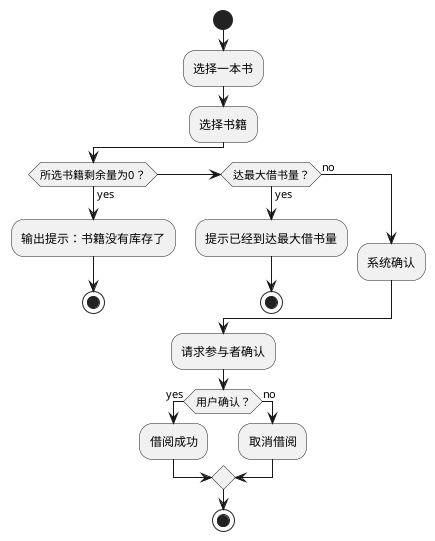

用例流程图如下:

	

用例规约如下:

| 用例名称                                                     | 借出图书                                                     |
| ------------------------------------------------------------ | ------------------------------------------------------------ |
| 参与者                                                       | 图书管理员、读者                                             |
| 前置条件                                                     | 参与者查询一本书                                             |
| 后置条件                                                     | 系统借出一本图书                                             |
| 主事件流                                                     |                                                              |
| 参与者动作                                                   | 系统行为                                                     |
| 1.参与者选择一本书借阅     3.参与者确认所选书籍；            | 2.系统提示参与者选择的书籍是否借阅；      3.借阅成功，使得这本书的数量减1，用例结束； |
| 备选事件流                                                   |                                                              |
| 2a.参与者所选中的书籍数量为零       1.系统提示书籍没有库存了，用例结束  2b.参与者选择的图书最大借书量      1.系统提示已经到达最大借书量，请归还一些书后再借，用例结束  3a.用户取消所选书籍       1.系统取消书籍锁定，用例结束 |                                                              |
| 业务规约                                                     |                                                              |
| 每个人借阅的书籍数量是有限的                                 |                                                              |

### 3.7归还图书用例

用例流程图源码如下:

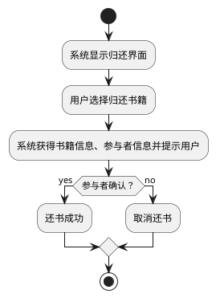

用例流程图如下:

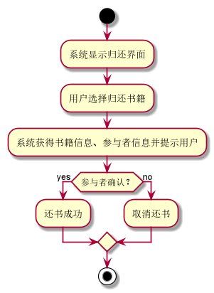	

用例规约如下:

| 用例名称                                                     | 归还图书                                                     |
| ------------------------------------------------------------ | ------------------------------------------------------------ |
| 参与者                                                       | 图书管理员、读者                                             |
| 前置条件                                                     | 参与者登陆图书管理系统                                       |
| 后置条件                                                     | 系统收回一本图书                                             |
| 主事件流                                                     |                                                              |
| 参与者动作                                                   | 系统行为                                                     |
| 2.参与者选择归还书籍     4.参与者确认还书；                  | 1.系统显示归还界面  3.系统获得书籍信息、参与者信息并提示用户；   5.还书成功，用例结束； |
| 备选事件流                                                   |                                                              |
| 2a.系统没有获得书籍信息       1.系统提示没有归还书籍，用例结束  3a.用户取消所选图书      1.系统取消书籍，用例结束    4a.参与者取消归还书籍       1.系统取消还书，用例结束 |                                                              |
| 业务规约                                                     |                                                              |
| 在有图书的前提下可归还读本书                                 |                                                              |

​		

### 3.8读者信息查询用例

用例流程图源码如下:

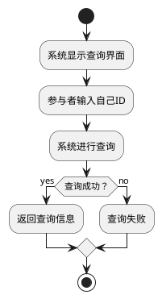

用例流程图如下:

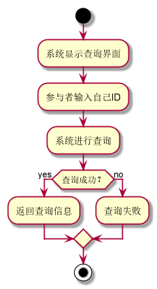	

用例规约如下:

| 用例名称                                                     | 读者信息查询                                                 |
| ------------------------------------------------------------ | ------------------------------------------------------------ |
| 参与者                                                       | 图书管理员                                                   |
| 前置条件                                                     | 参与者登陆图书管理系统                                       |
| 后置条件                                                     | 系统查询读者信息                                             |
| 主事件流                                                     |                                                              |
| 参与者动作                                                   | 系统行为                                                     |
| 2.参与者输入查询的用户名字                                   | 1.系统显示查询面板；     3.系统根据输入显示用户的名字，身份，已借书籍，用例结束； |
| 备选事件流                                                   |                                                              |
| 3a.系统没有查到这个用户      1.系统提示没有查到这个用户，用例结束 |                                                              |
| 业务规约                                                     |                                                              |
| 1.参与者只能输入用户的名字：                                 |                                                              |

### 3.9系统管理用例

用例流程图源码如下:

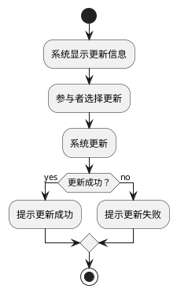

用例流程图如下:

	

用例规约如下:

| 用例名称                                          | 系统管理                                                     |
| ------------------------------------------------- | ------------------------------------------------------------ |
| 参与者                                            | 系统管理员                                                   |
| 前置条件                                          | 参与者登陆图书管理系统                                       |
| 后置条件                                          | 系统完成更新                                                 |
| 主事件流                                          |                                                              |
| 参与者动作                                        | 系统行为                                                     |
| 2.参与者选择更新                                  | 1.系统显示更新信息；     3.系统进入更新，并返回更新结果，用例结束； |
| 备选事件流                                        |                                                              |
| 3a.系统更新失败      1.系统提示更新失败，用例结束 |                                                              |
| 业务规约                                          |                                                              |
| 系统更新会返回更新信息                            |                                                              |