# 实验2：图书管理系统用例建模
|     学号     |     班级     | 姓名 |
| :----------: | :----------: | :--: |
| 201710414108 | 软件(本)17-1 | 李兴 |
## 1. 图书管理系统的用例关系图

### 1.1 用例图源码：

``` usecase
@startuml
usecase (预定图书)
usecase (取消预定)
usecase (读者信息管理)
usecase (查询图书)
usecase (借出图书)
usecase (归还图书)
usecase (维护书目)
usecase (查询借阅情况)
usecase (购入图书)
usecase (管理系统)

actor :图书管理员:
actor :读者:
actor :系统管理员:

:图书管理员: --> (检索图书)
:图书管理员: --> (读者信息管理)
:图书管理员: --> (维护书目)
:图书管理员: --> (查询图书)
:图书管理员: --> (查询借阅情况)

:读者: --> (查询图书)
:读者: --> (查询借阅情况)
:读者: --> (预定查询)

:系统管理员: --> (管理系统)

(维护书目) --> (购入图书) : <<include>>
(检索图书) --> (借出图书) : <<include>>
(检索图书) --> (归还图书) : <<include>>
(预定查询) --> (预定图书) : <<include>>
(预定查询) --> (取消预定) : <<include>>

@enduml
```


### 1.2. 用例图如下：

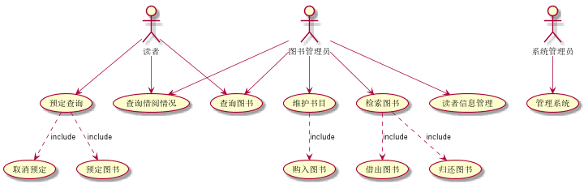	

## 2. 参与者说明：

###     2.1 图书管理员

主要职责是：管理图书馆所有的书籍借出与归还,管理图书，管理读者信息

###     2.2 读者

主要职责是：在图书馆中进行书目的查询，查询借阅情况，预定图书和取消预定图书

###     2.3 系统管理员

主要职责是：管理系统

## 3.用例规约图

### 3.1查询图书用例

用例流程图源码如下:

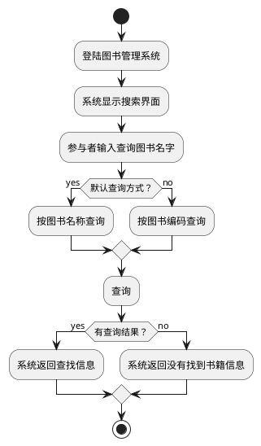

用例流程图如下:

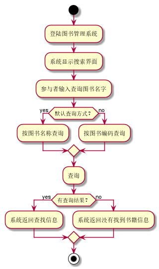	

用例规约如下:

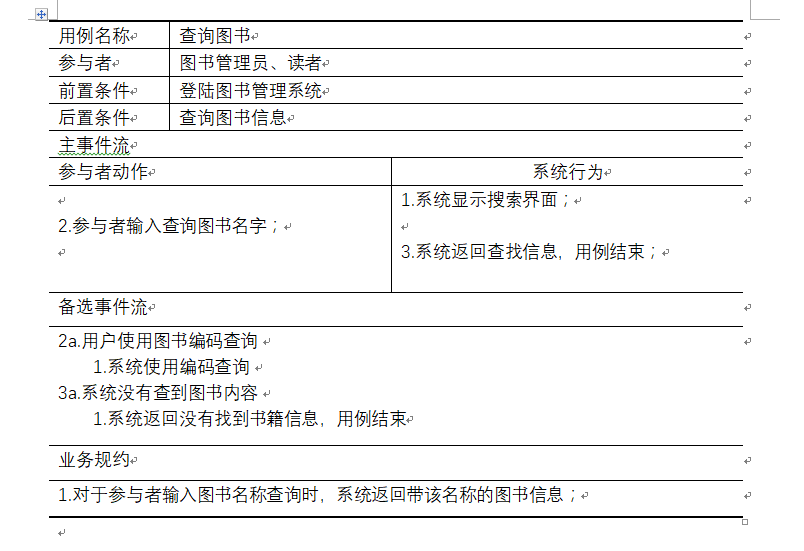	

### 3.2预定图书用例

用例流程图源码如下:


用例流程图如下:

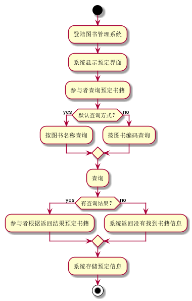	

用例规约如下:

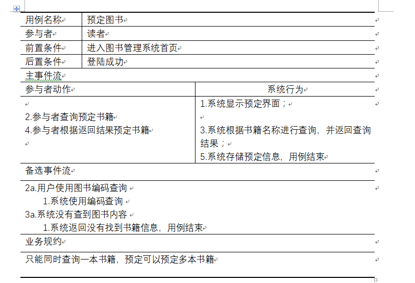	

### 3.3取消预定用例

用例流程图源码如下:

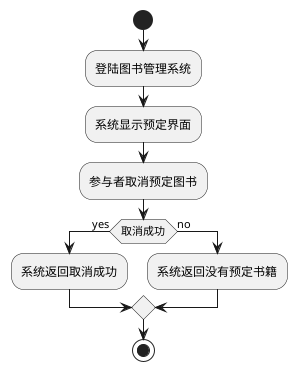

用例流程图如下:

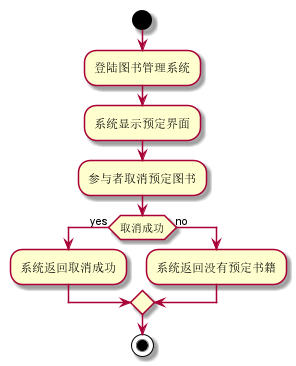	

用例规约如下:

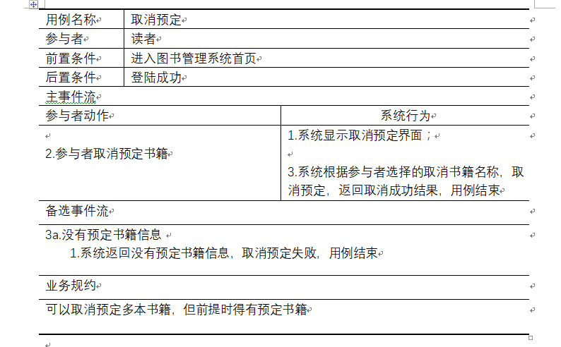	

### 3.4查询借阅情况用例

用例流程图源码如下:

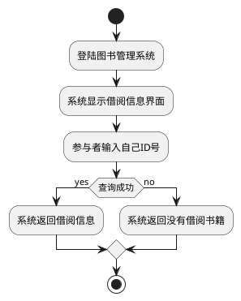

用例流程图如下:

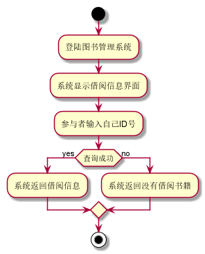	

用例规约如下:

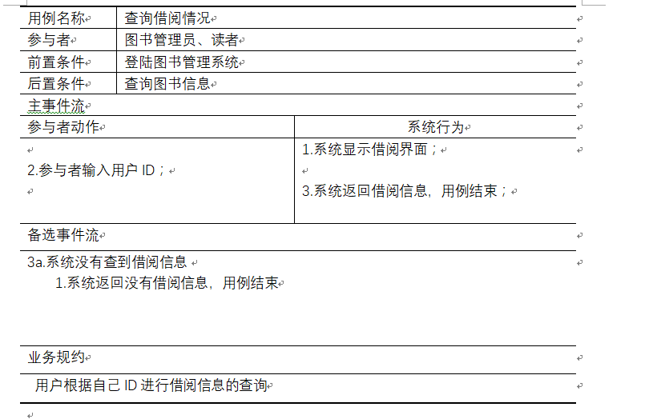	

### 3.5购入图书用例

用例流程图源码如下:

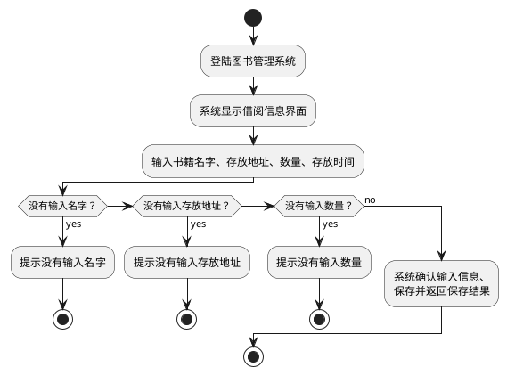

用例流程图如下:

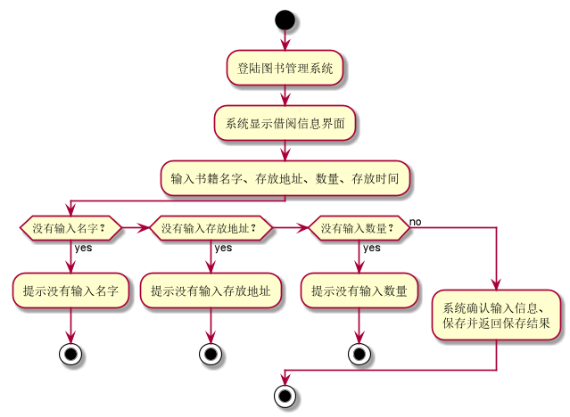	

用例规约如下:

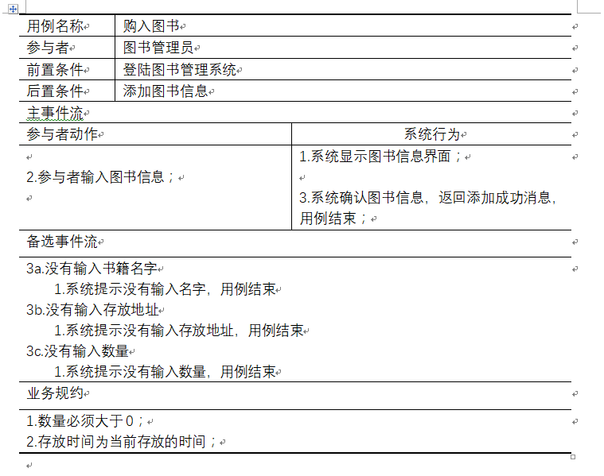	

### 3.6借出图书用例

用例流程图源码如下:

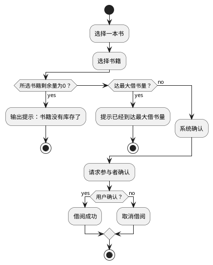

用例流程图如下:

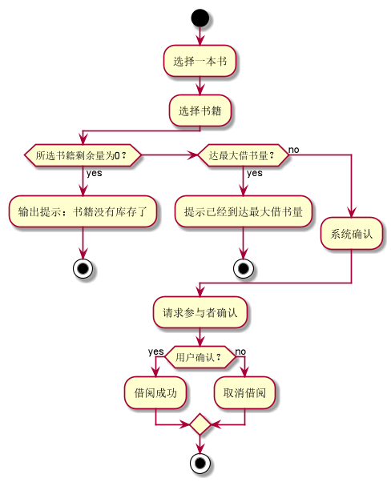	

用例规约如下:

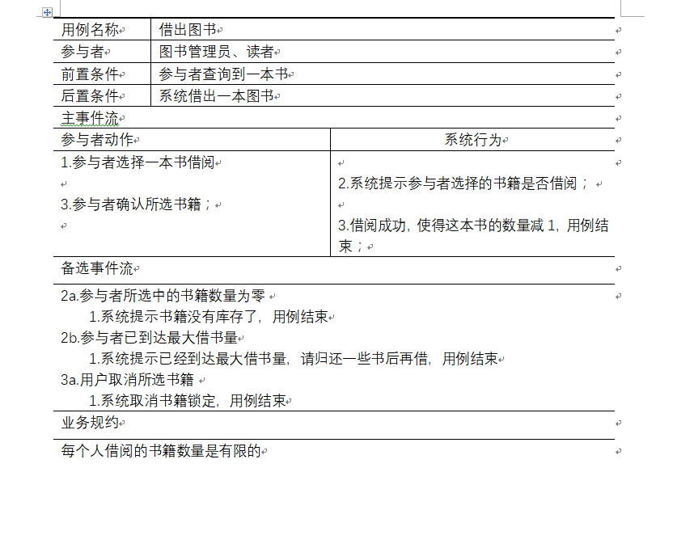

### 3.7归还图书用例

用例流程图源码如下:

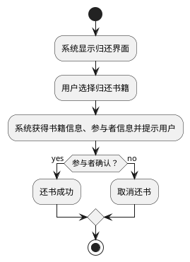

用例流程图如下:

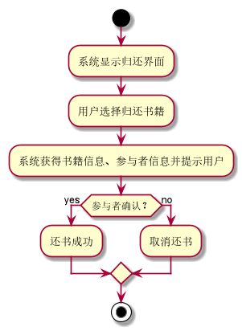	

用例规约如下:

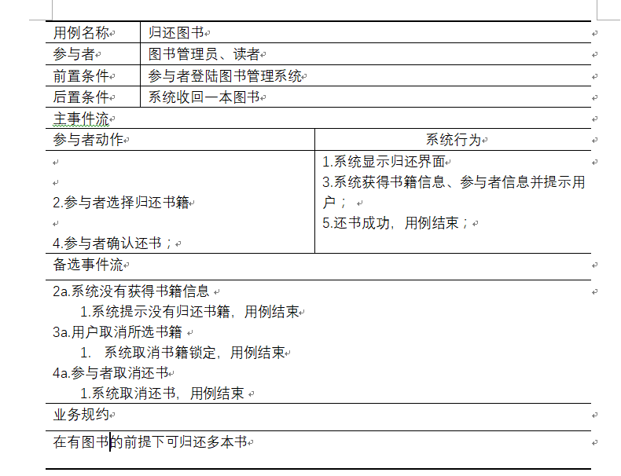		

### 3.8读者信息查询用例

用例流程图源码如下:

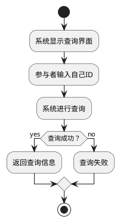

用例流程图如下:

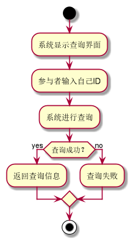	

用例规约如下:


### 3.9系统管理用例

用例流程图源码如下:

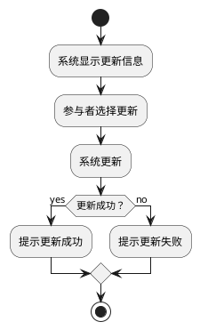

用例流程图如下:

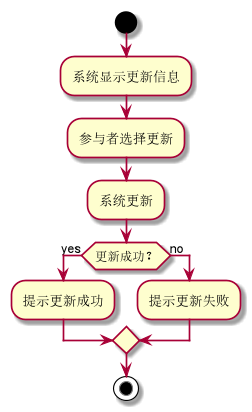	

用例规约如下:

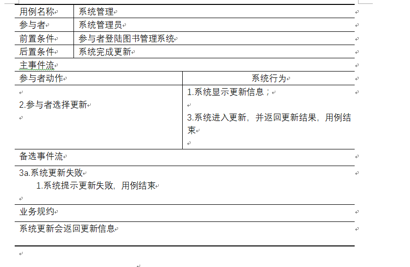
