# 实验3：图书管理系统领域对象建模
|     学号     |     班级     | 姓名 |
| :----------: | :----------: | :--: |
| 201710414108 | 软件(本)17-1 | 李兴 |
## 1. 图书管理系统的类图

### 1.1类图PlantUML源码如下：

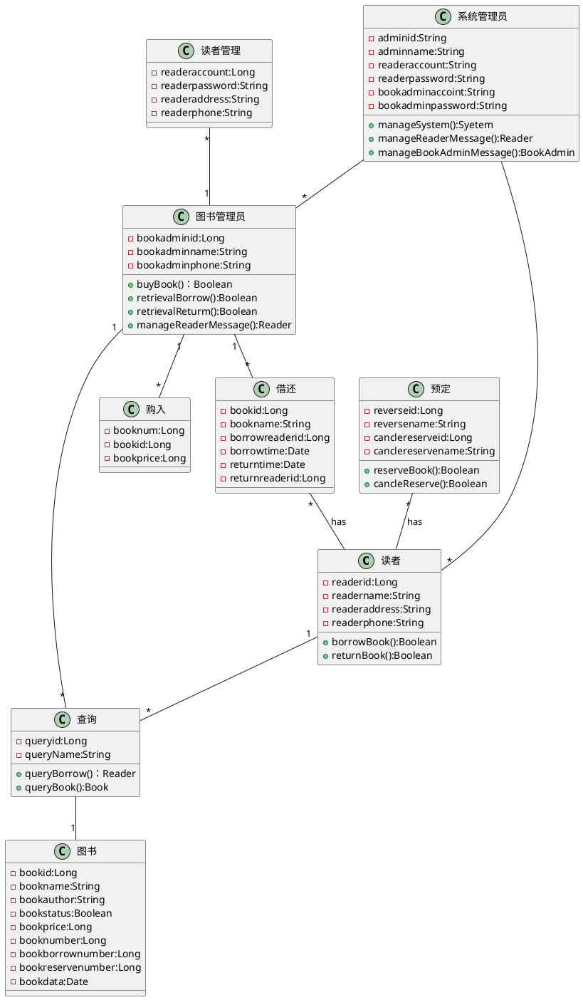

### 1.2类图如下:

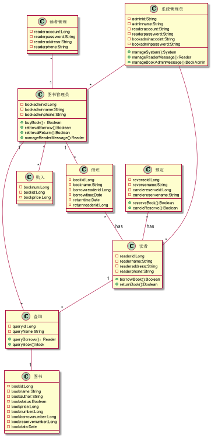	

### 1.3类图说明:

对于一个读者来说他可以多次借书还书，多次预定退订图书；对于一个图书管理员来说他可以购入多本图书，可以多次管理借还书的情况，可以管理多个读者的信息；图书管理员和读者都可以多次查询图书情况，而根据图书名和编号查询的结果一般只对应一种查询结果；系统管理员可以管理多个图书管理员和读者。

## 2.图书管理系统的对象图

### 2.1类读者(Reader)的对象图

#### 2.1.1源码如下：

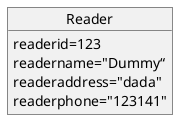

#### 2.1.2对象图如下:

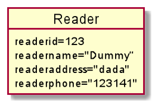	

### 2.2类图书管理员(BookAdmin)的对象图

#### 2.2.1源码如下:

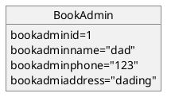

#### 2.2.2对象图如下:

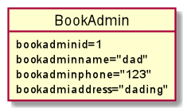	

### 2.3类系统管理员(SystemManager)的对象图

#### 2.3.1源码如下:

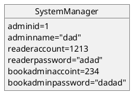

#### 2.3.2对象图如下:

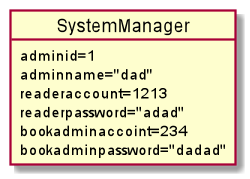		

### 2.4类查询(Query)的对象图

#### 2.3.1源码如下:

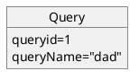

#### 2.3.2对象图如下:

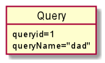			

### 2.5类图书(Book)的对象图

#### 2.5.1源码如下:

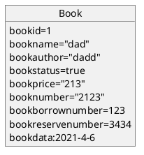

#### 2.5.2对象图如下:

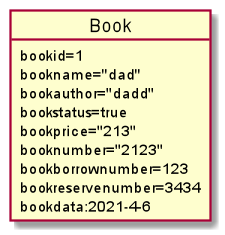		

### 2.6类购入(Bought)的对象图

#### 2.6.1源码如下:

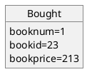

#### 2.6.2对象图如下:

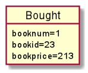			

### 2.7类借还(BorrowReturn)的对象图

#### 2.7.1源码如下:

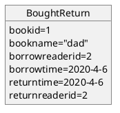

#### 2.7.2对象图如下:

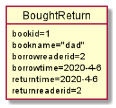	

### 2.8类预定(Reverse)的对象图

#### 2.8.1源码如下:

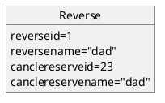

#### 2.8.2对象图如下:

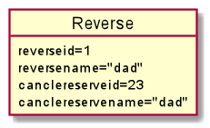	