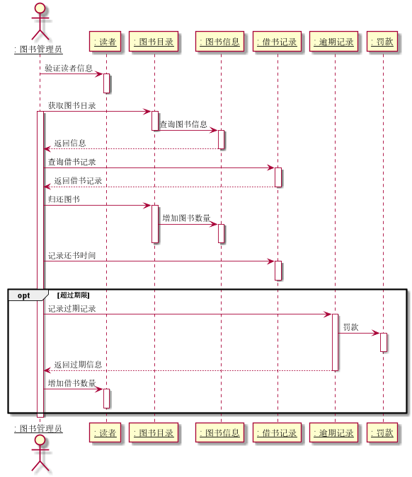

# 实验4：图书管理系统领域对象建模
|     学号     |     班级     | 姓名 |
| :----------: | :----------: | :--: |
| 201710414108 | 软件(本)17-1 | 李兴 |

## 图书管理系统的顺序图

---

### 1.借书用例

#### 1.1借书用例PlantUML源码

#### 1.2借书用例顺序图

	

#### 1.3借书用例顺序图说明

图书管理员首先查询读者的信息，根据查询的信息获取读者借书数量，然后判断其数量是否超过可借数量，如果超过可借数量则借书失败，没超过则获取图书目录，查询改图书信息，得到信息后创建一条借书记录然后借出图书，之后减少借出图书的数量，减少读者可借书的数量，结束流程。

### 2.还书用例

#### 2.1还书用例PlantUML源码

#### 2.2还书用例顺序图

	

#### 2.3还书用例顺序图说明

图书管理员首先查询读者的信息，根据查询的信息获取图书目录信息，然后查询图书信息，根据返回信息查询借书记录，得到借书记录后归还图书，增加图书数量，记录换书时间；如果超过还书时间则进行罚款，在还书之后增加读者借书的数量，结束流程。

### 3.购入图书用例

#### 3.1购入图书用例PlantUML源码

#### 3.2购入图书用例顺序图

		

#### 3.3购入图书用例顺序图说明

图书管理员首先登录自己账号，然后可以先查询图书目录，再根据图书类型进行查询，返回图书类型信息之后在查询信息，得到信息之后就可以添加购入图书的信息，图书信息被修改，借书流程。

### 4.预定图书用例

#### 4.1预定图书用例PlantUML源码

#### 4.2预定图书用例顺序图

			

#### 4.3预定图书用例顺序图说明

读者首先登录自己账号，然后可以查询图书目录，再根据目录查询图书信息，得到查询信息，然后可以查询可预订图书数量，根据返回信息进行判断，如果没有预定记录则可以预定图书，有预定图书信息，可以直接查询已预定图书信息。

### 5.取消预定图书用例

#### 5.1取消预定图书用例PlantUML源码

#### 5.2取消预定图书用例顺序图

				

#### 5.3取消预定图书用例顺序图说明

读者首先登录自己账号，然后查看预定记录，根据返回记录进行选择，没有预定记录就不用管，有预定记录则可以删除预定记录，结束流程。

### 6.查询图书用例

#### 6.1查询图书用例PlantUML源码

#### 6.2查询图书用例顺序图

					

#### 6.3查询图书用例顺序图说明

读者首先登录自己账号，然后可以查看图书目录，根据图书目录查询图书信息，然后得到查询的信息，结束流程。

### 7.读者信息管理用例

#### 7.1读者信息管理用例PlantUML源码

#### 7.2读者信息管理用例顺序图

					

#### 7.3读者信息管理用例顺序图说明

图书管理员首先登录自己账号，然后可以查询读者信息，根据返回的读者信息可以管理读者信息，结束流程。

### 8.系统管理用例

#### 8.1系统管理用例PlantUML源码

#### 8.2系统管理用例顺序图

					

#### 8.3系统管理用例顺序图说明

系统管理员首先登录自己账号，然后可以查询系统信息，根据返回系统信息可选择升级系统，如果升级成功，则系统会返回成功消息，若升级失败，系统返回失败原因，结束流程。