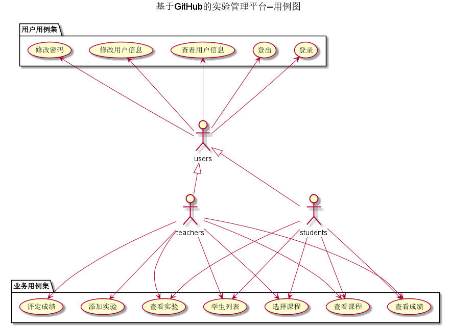

# 基于GitHub的实验管理平台的分析与设计

#### 成都大学信息科学与工程学院

|     学号     |     班级     | 姓名 |
| :----------: | :----------: | :--: |
| 201710414108 | 软件(本)17-1 | 李兴 |

## 1.概述

- 基于GitHub的实验管理平台的作用是在线管理实验成绩的Web应用系统。学生和老师的实验内容均存放在GitHUB 页面上。
- 学生的功能主要有：一是设置自己的GitHub用户名，二是查询自己所选课程，三是查询自己所选课程的实验成绩，四是可以选择多门课程。学生的GitHub用户名是公开的，但成绩不公开。
- 老师的功能主要有：一是批改每个学生的成绩，二是查看每个学生的成绩，三是选择老师的课程，四是添加每个学期的实验。
- 老师和学生都能通过本系统的链接方便地跳转到学生的每个GitHUB实验目录，以便批改实验或者查看实验情况。
-  老师可将每个实验的实验成绩细分为多个评分项，每个评分项对应各自的评分标准。 老师在批改实验的时候，对每个评分项进行评分并输入对应的文字评价，系统自动计算出所有评分项的成绩之和为该实验的总成绩 
- 实验成绩按数字分数计算，每项实验的满分为100分，最低为0分。
- 系统自动计算每个学生的所有实验的平均分

## 2.系统总体结构

[系统总体结构设计参见](https://SuperTchain.github.io/is_analysis/test6/ui/主界面.html)

## 3.用例图设计 [源码](./source_code/example.puml)

	

## 4.类图设计 [源码](./source_code/class.puml)

	

## 5.数据库设计

- [参见数据库设计](./Sql/README.md)

## 6.用例及界面详细设计

1.[用户登录用例](./example/用户登录.md) [界面](https://SuperTchain.github.io/is_analysis/test6/ui/登录.html)

2.[用户退出用例](./example/用户退出.md) [界面](https://SuperTchain.github.io/is_analysis/test6/ui/登出.html)

3.[修改用户信息用例](./example/修改用户信息.md)  [界面](https://SuperTchain.github.io/is_analysis/test6/ui/修改用户信息.html)

4.[查看用户信息用例](./example/查看用户信息.md)  [界面](https://SuperTchain.github.io/is_analysis/test6/ui/用户信息.html)

5.[选择课程用例](./example/选择课程.md)  [界面](https://SuperTchain.github.io/is_analysis/test6/ui/选择课程.html)

6.[修改用户密码用例](./example/修改用户密码.md)  [界面](https://SuperTchain.github.io/is_analysis/test6/ui/修改密码.html)

7.[查看实验用例](./example/查看实验.md)  [界面](https://SuperTchain.github.io/is_analysis/test6/ui/查看实验.html)

8.[老师发布实验用例](./example/发布实验.md)  [界面](https://SuperTchain.github.io/is_analysis/test6/ui/发布实验.html)

9.[查看课程用例](./example/查看课程.md)  [界面](https://SuperTchain.github.io/is_analysis/test6/ui/查看课程.html)

10.[查看学生列表用例](./example/查看学生列表.md)  [界面](https://SuperTcahin.github.io/is_analysis/test6/ui/主界面.html)

11.[查看成绩用例](./example/查看成绩.md)  [界面](https://SuperTchain.github.io/is_analysis/test6/ui/成绩查询.html)

12.[评定成绩用例](./example/评定成绩.md)  [界面](https://SuperTchain.github.io/is_analysis/test6/ui/评定成绩.html)
