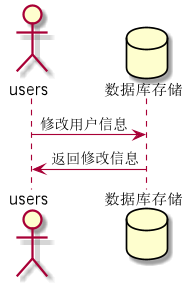

# 修改用户信息用例 [返回](../README.md)

## 1. 用例规约

| 用例名称   | 修改用户信息                                                 |
| ---------- | :----------------------------------------------------------- |
| 功能       | 修改用户的GitHub用户名称                                     |
| 参与者     | 学生，老师                                                   |
| 前置条件   | 必须先登录，并且查看用户现有的GitHub用户名                   |
| 后置条件   |                                                              |
| 主事件流   | 1.用户填写GitHub用户名称 <br/> 2.用户提交修改信息 <br/>3.系统存储修改后的GitHub用户名称 |
| 备选事件流 | 1a. 如果用户输入的GitHub用户名称为空 <br/>&nbsp;&nbsp; 1.系统清空用户的GitHub用户名称 <br>&nbsp;&nbsp; 2.提示重新输入 |

## 2. 业务流程 [源码](../source_code/修改用户信息.puml)

	

## 3. 界面设计

- 界面参照: https://SuperTchain.github.io/is_analysis/test6/ui/修改用户信息.html
- API接口调用
  - 接口1：[getUserInfo](../interface/getUserInfo.md)
  - 接口2：[updateUserInfo](../interface/updateUserInfo.md)

## 4. 算法描述

```
无
```


## 5. 参照表

- [users](../Sql/README.md/#users)