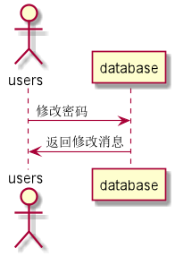

# 修改密码用例 [返回](../README.md)

## 1. 用例规约

| 用例名称   | 修改密码                                                     |
| ---------- | :----------------------------------------------------------- |
| 功能       | 修改用户的密码                                               |
| 参与者     | 学生，老师                                                   |
| 前置条件   | 必须先登录                                                   |
| 后置条件   | 修改密码以后必须强制登出，再跳转到登录页面                   |
| 主事件流   | 1.用户填写旧密码  <br/> 2.用户填写新密码（两次输入） <br/> 3.用户提交修改信息 <br/>4.系统存储修改后密码 |
| 备选事件流 | 1a.用户旧密码与数据库存储密码不符<br/>&nbsp;&nbsp; 1.系统提示旧密码不正确  <br/>&nbsp;&nbsp; 2. 用户重新填写并提交。<br>2a. 用户两次输入的密码不同 <br/>&nbsp;&nbsp; 1.系统提示两次输入的密码不相同  <br/>&nbsp;&nbsp; 2. 用户重新填写并提交。 |

## 2. 业务流程[源码](../source_code/修改密码.puml)

	

## 3. 界面设计

- 界面参照: https://SuperTchain.github.io/is_analysis/test6/ui/修改密码.html
- API接口调用
  - 接口1：[setPassword](../interface/setPassword.md)

## 4. 算法描述 

```
无
```

## 5. 参照表

- [users](../Sql/README.md/#users)