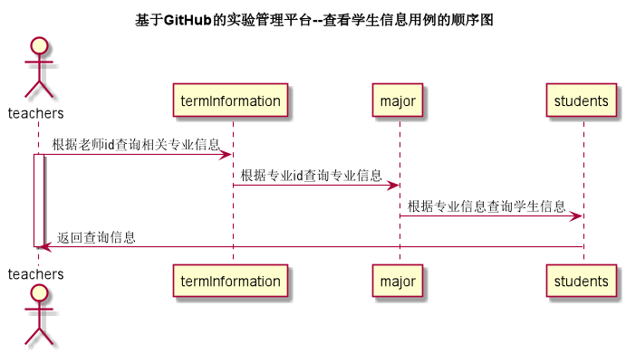

# 查看学生列表用例 [返回](../README.md)

## 1. 用例规约

| 用例名称   | 查看学生信息                                    |
| ---------- | :---------------------------------------------- |
| 功能       | 查看当前实验下的学生信息                        |
| 参与者     | 学生/老师                                       |
| 前置条件   |                                                 |
| 后置条件   |                                                 |
| 主事件流   | 1. 查询当前实验下的全部学生信息                 |
| 备选事件流 | 1a.查询失败  &nbsp;&nbsp; 1.系统提示查询失败 |

## 2. 业务流程 [源码](../source_code/查看学生列表.puml)

	

## 3. 界面设计

- 界面参照: https://SuperTcahin.github.io/is_analysis/test6/ui/主界面.html
- API接口调用
  - 接口1：[getCourseTestAllStudents](../interface/getCourseTestAllStudents.md)

## 4. 算法描述

    无

## 5. 参照表

- [students](../Sql/README.md/#students)
- [major](../Sql/README.md/#major)
- [tests](../Sql/README.md/#tests)
- [termInformation](../Sql/README.md/#termInformation)