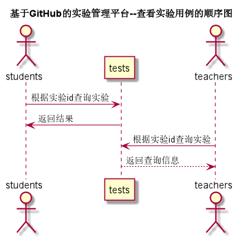

# 查看实验用例 [返回](../README.md)

## 1. 用例规约

| 用例名称   | 查看实验                                        |
| ---------- | :---------------------------------------------- |
| 功能       | 查询当前课程下已发布的全部实验                  |
| 参与者     | 学生/老师                                       |
| 前置条件   |                                                 |
| 后置条件   |                                                 |
| 主事件流   | 1. 查询实验信息                                 |
| 备选事件流 | 1a.查询失败  &nbsp;&nbsp; 1.系统提示查询失败 |

## 2. 业务流程 [源码](../source_code/查看实验.puml)

	 

## 3. 界面设计

- 界面参照: https://SuperTchain.github.io/is_analysis/test6/ui/查看实验.html
- API接口调用
  - 接口1：[getCourseAllTests](../interface/getCourseAllTests.md)

## 4. 算法描述

    无

## 5. 参照表

- [tests](../Sql/README.md/#tests)