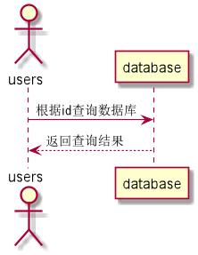

# 查看用户信息用例 [返回](../README.md)

## 1. 用例规约

| 用例名称   | 查看用户信息       |
| ---------- | :----------------- |
| 功能       | 查看用户的所有信息 |
| 参与者     | 学生，老师         |
| 前置条件   | 必须先登录         |
| 后置条件   |                    |
| 主事件流   |                    |
| 备选事件流 |                    |

## 2. 业务流程

    无

## 3. 界面设计

- 界面参照: https://SuperTchain.github.io/is_analysis/test6/ui/用户信息.html
- API接口调用
  - 接口1：[getUserInfo](../interface/getUserInfo.md)

## 4. 算法描述[源码](../source_code/查看用户信息.puml)

	
    

## 5. 参照表

- [students](../Sql/README.md/#students)
- [teachers](../Sql/README.md/#teachers)
- [users](../Sql/README.md/#users)