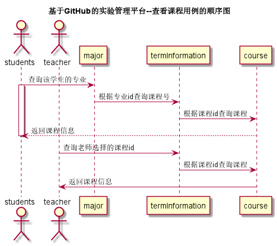

# 查看课程用例 [返回](../README.md)

## 1. 用例规约

| 用例名称   | 查看课程                                               |
| ---------- | :----------------------------------------------------- |
| 功能       | 查看用户当前学期已选择课程                             |
| 参与者     | 学生/老师                                              |
| 前置条件   | 用户已登录                                             |
| 后置条件   |                                                        |
| 主事件流   | 1.查询需要查看课程的相关信息                           |
| 备选事件流 | 1a.查询数据出错 &nbsp;&nbsp; 1.系统提示查询数据出错 |

## 2. 业务流程 [源码](../source_code/查看课程.puml)

 

## 3. 界面设计

- 界面参照: https://SuperTchain.github.io/is_analysis/test6/ui/查看课程.html
- API接口调用
  - 接口1：[getCourseByTeacher](../interface/getCourseByTeacher.md)
  - 接口2：[getCourseByStudent](../interface/getCourseByStudent.md)

## 4. 算法描述

    无

## 5. 参照表

- [teachers](../Sql/README.md/#teachers)
- [students](../Sql/README.md/#students)
- [major](../Sql/README.md/#major)
- [course](../Sql/README.md/#course)
- [term](../Sql/README.md/#term)