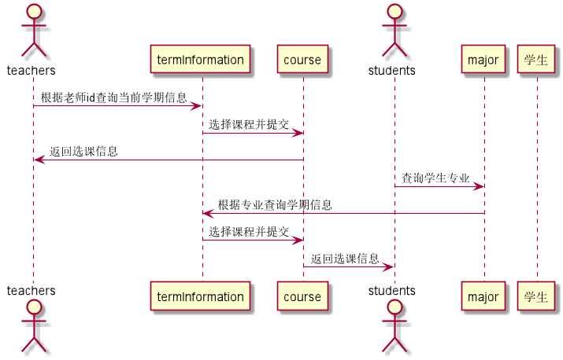

# 选择课程用例 [返回](../README.md)

## 1. 用例规约

| 用例名称   | 选择课程                                                     |
| ---------- | :----------------------------------------------------------- |
| 功能       | 老师选择课程                                                 |
| 参与者     | 老师                                                         |
| 前置条件   | 必须先登录，选择课程必须是当前学期开课课程                   |
| 后置条件   |                                                              |
| 主事件流   | 1.查询当前学期开课课程    2.选择课程                     |
| 备选事件流 | 1a.查询无课程 &nbsp;&nbsp; 1.系统提示无课程可选择 2a. 课程已被选择  &nbsp;&nbsp; 1.系统提示课程被选择   &nbsp;&nbsp; 2. 老师重新选择。 |

| 用例名称   | 选择课程                                                     |
| ---------- | :----------------------------------------------------------- |
| 功能       | 学生选择课程                                                 |
| 参与者     | 学生                                                         |
| 前置条件   | 必须先登录，选择课程必须是当前学期开课课程，课程已被老师选择 |
| 后置条件   |                                                              |
| 主事件流   | 1.查询当前学期开课并已被教师选择的符合学生专业学期的课程    2.选择课程 |
| 备选事件流 | 1a.查询无课程 &nbsp;&nbsp; 1.系统提示无课程可选择 2a. 课程已选择  &nbsp;&nbsp; 1.系统提示课程已被选择，无需重选   &nbsp;&nbsp; |

## 2. 业务流程  [源码](../source_code/选择课程.puml)

 

## 3. 界面设计

- 界面参照: https://SuperTchain.github.io/is_analysis/test6/ui/选择课程.html
- API接口调用
  - 接口1：[getOpenCourseByTeacher](../interface/getOpenCourseByTeacher.md)
  - 接口2：[getOpenCourseByStudent](../interface/getOpenCourseByStudent.md)
  - 接口3：[setTeacherSelectCourse](../interface/setTeacherSelectCourse.md)
  - 接口4：[setStudentSelectCourse](../interface/setStudentSelectCourse.md)

## 4. 算法描述 

    无

## 5. 参照表

- [users](../Sql/README.md/#users)
- [teachers](../Sql/README.md/#teachers)
- [students](../Sql/README.md/#students)
- [major](../Sql/README.md/#major)
- [course](../Sql/README.md/#course)
- [term](../Sql/README.md/#term)